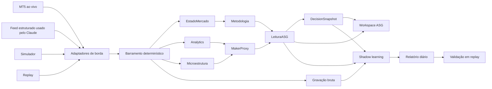
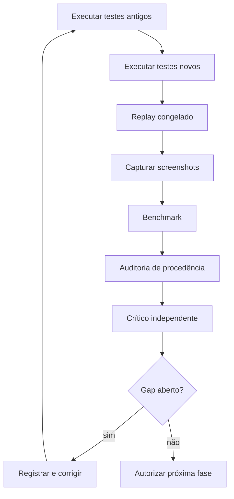

# Briefing completo para Claude — Operador B3 ASG-like

## 1. Contrato da missão

Você é o líder técnico responsável por evoluir o repositório `OPERADOR-B3` para uma plataforma de leitura de fluxo ASG-like, preservando integralmente o que já funciona.

O resultado deve reunir:

- DOM, Tape, Bookmap e Volume por preço;
- Agressão, Delta, Absorção, Reposição e Clips;
- Macro, Micro, Linha Azul, Regime, MakerProxy e Velocímetro;
- Placar, Região, Pré-sinal, Confirmação, Stop e Alvos;
- feed ao vivo unificado;
- replay determinístico;
- aprendizado contínuo em shadow mode;
- auditoria automática de integração;
- interface visualmente coerente com a categoria da ASG.

Não copie código, marca, logotipo ou ativos proprietários da ASG. Reproduza apenas conceitos publicamente observáveis, fluxo de uso, densidade, hierarquia visual e funcionalidades que possam ser implementadas de forma independente.

O produto continuará sendo exclusivamente consultivo e não poderá enviar ordens.

---

## 2. Verdades atuais do repositório

Antes de implementar, confirme novamente no código, mas parta destas evidências:

- PySide6/Qt6 com painéis desenhados em QPainter;
- barramento síncrono e determinístico;
- preços internos em ticks inteiros;
- fontes: simulador, replay e MT5;
- snapshots imutáveis para impedir leitura concorrente inconsistente;
- workspaces atuais: Fluxo, Book & Tape, Bookmap e Revisão;
- analytics de agressão, delta, footprint, volume profile e VWAP;
- microestrutura com MBP→MBO inferido;
- detectores de absorção, escora, iceberg/recarga, exaustão, liquidez fantasma e clips;
- metodologia com Macro, Micro, Regime, Linha Azul, Velocímetro e Placar;
- Maker original registrado honestamente como não reproduzível por ausência de fórmula;
- nenhuma ponte estruturada chamada “Claude” encontrada no clone;
- feed textual de LLM não é equivalente a feed de mercado estruturado;
- baseline parcial já observado: 755 testes passaram e 14 foram ignorados no ambiente sem todas as dependências visuais.

Leia obrigatoriamente antes de alterar:

- `pesquisa/ferramenta_componentes.md`;
- `fluxopro/app/sessao_fluxo.py`;
- `fluxopro/ui/janela.py`;
- testes de pipeline, MT5, UI, replay e ausência de execução de ordens.

---

## 3. Referências visuais congeladas

### Estado atual que não pode regredir


### Referência de DOM


### Referência de Tape e participantes


Crie um pacote congelado `ASG-like Reference Pack v1` contendo essas imagens, capturas públicas relevantes, os screenshots da ASG que o operador fornecer e um arquivo de procedência.

Sem screenshots reais da ASG, use a expressão “ASG-like funcional”. Não declare paridade visual ou pixel-perfect.

---

## 4. Arquitetura-alvo



### Invariantes

- Uma única publicação ordenada por evento.
- Nenhum widget acessa objeto vivo da thread de mercado.
- Um snapshot consistente por quadro.
- Coleções do caminho quente devem ter tamanho limitado.
- Nenhum histórico cresce indefinidamente em memória.
- LLM nunca participa do processamento por tick.
- Falha ou ausência de dados deve ser visível.
- Toda leitura derivada deve carregar procedência e confiança.

---

## 5. Distribuição da equipe

Claude deverá dividir a execução entre especialistas, preferencialmente em worktrees independentes.

| Frente | Responsabilidade | Entrega |
|---|---|---|
| Arquitetura | Coordenar contratos e integração | ADRs, sequência de merges e invariantes |
| Feed | Descobrir e integrar MT5/Claude | Adaptador unificado, status e reconexão |
| Microestrutura | Construir MakerProxy | cálculo, evidências e snapshots |
| Metodologia | Integrar matriz e decisão | LeituraASG e DecisionSnapshot |
| UI | Criar workspace ASG | painéis, layout, estados e screenshots |
| Dados/ML | Shadow learning | dataset, labels, replay e relatório |
| QA | Testes e performance | suíte, benchmarks e regressão visual |
| Auditoria | Revisão independente | gaps, procedência e integração |
| Críticos cegos | Comparar artefatos | vereditos Gauntlet com evidências |

Nenhuma equipe poderá validar o próprio trabalho. Alterações sobre os mesmos arquivos deverão ser serializadas pelo líder.

---

## 6. Plano de implementação

### Fase 0 — congelar baseline

Antes do primeiro código:

1. Criar branch `feat/asg-like-v1`.
2. Registrar commit-base e status do worktree.
3. Rodar todos os testes possíveis.
4. Registrar testes bloqueados por dependências.
5. Executar simulador e replay.
6. Capturar screenshots de todos os workspaces.
7. Registrar throughput e p95 de renderização.
8. Confirmar que não existe envio de ordens.
9. Inventariar as 54 entradas de vídeo e as 50 transcrições existentes.
10. Identificar os quatro vídeos ausentes.
11. Produzir `BASELINE_ASG.md`.

Nenhuma regressão posterior poderá ser aceita como “necessária para a nova interface”.

### Fase 1 — descobrir o feed recebido pelo Claude

Não presuma o protocolo. Localize a fonte real e documente:

```text
origem
transporte
autenticação
schema
frequência
timestamp
sequência
book disponível
profundidade
qualidade do agressor
reconexão
limites
```

Classifique:

- feed estruturado apto;
- feed estruturado incompleto;
- somente MT5;
- somente texto/imagem;
- integração inexistente.

Se for texto ou imagem, não o transforme em ticks. Use o adaptador MT5 existente ou conecte a fonte estruturada original.

### Fase 2 — contrato de feed unificado

Preserve `Trade`, `BookSnapshot` e `BookDelta` para não quebrar assinantes e gravações.

Adicione um canal separado:

```text
FeedQualitySnapshot
- source
- state
- market_timestamp_ns
- ingress_timestamp_ns
- latency_ms
- sequence
- dropped_events
- duplicated_events
- book_kind: NONE | MBP | MBO
- book_depth
- aggressor_quality
- reconnect_count
- details
```

Adicionar uma fonte externa somente se o contrato real existir. O adaptador deve:

- traduzir para os eventos atuais;
- deduplicar por sequência/ID;
- rejeitar timestamp regressivo;
- sinalizar lacunas;
- reconectar com backoff limitado;
- nunca alternar fonte silenciosamente;
- publicar status de saúde;
- encerrar de forma limpa.

### Fase 3 — MakerProxy

Criar:

```text
ConfigMakerProxy
MakerEvidence
MakerComponentScore
MakerProxySnapshot
MakerProxy
```

#### Janelas iniciais

- curta: 1 segundo;
- micro: 5 segundos;
- contexto: 30 segundos;
- persistência mínima: 3 segundos;
- relevância inicial: 7%;
- confiança mínima para relevância: 0,60.

Esses valores são defaults de engenharia e devem ser configuráveis. Não são fórmula da ASG.

#### Evidências

Calcule separadamente evidência compradora e vendedora:

- absorção: peso 0,30;
- reposição/escora/recarga: peso 0,30;
- divergência preço-fluxo: peso 0,20;
- clips: peso 0,10;
- contexto de agressão: peso 0,10.

Renormalize os pesos quando um componente estiver indisponível.

```text
net = (evidencia_buy - evidencia_sell)
      / (evidencia_buy + evidencia_sell + epsilon)

percentual = clamp(net × 100, -100, +100)

confiança = qualidade_feed
            × cobertura_componentes
            × estabilidade
```

Direção semântica:

- venda agressiva absorvida no bid reforça Maker comprador;
- compra agressiva absorvida no ask reforça Maker vendedor;
- reposição no bid reforça comprador;
- reposição no ask reforça vendedor;
- retirada rápida reduz persistência;
- oscilação frequente reduz estabilidade;
- MBP inferido reduz confiança;
- ausência ou atraso do book impede confirmação.

Estados:

```text
SEM_DADOS
SEM_BOOK
AJUSTANDO
NEUTRO
COMPRADOR
VENDEDOR
DIVERGENTE
```

Saída:

```text
MakerProxySnapshot
- timestamp_ns
- side
- percent
- confidence
- persistence_ns
- state
- component_scores
- component_coverage
- evidence
- source
- book_kind
- inferred
- formula_version
```

O MakerProxy não entra no Placar na primeira versão.

### Fase 4 — LeituraASG

Criar snapshot imutável:

```text
LeituraASG
- timestamp_ns
- macro
- micro
- linha_azul
- regime
- maker_proxy
- velocimetro
- placar
- feed_quality
- divergencias
- provenance
```

A sessão deverá congelar essa leitura na thread publicadora e disponibilizá-la à UI sem expor componentes mutáveis.

Adicionar flags:

```text
ligar_maker_proxy = False
ligar_leitura_asg = False
```

O workspace ASG poderá ativá-las explicitamente. Os fluxos antigos devem conservar os defaults atuais.

### Fase 5 — decisão consultiva

Criar:

```text
RegiaoOperacional
PropostaRisco
DecisionSnapshot
MotorDecisaoASG
```

`DecisionSnapshot` deverá conter:

- direção;
- placar;
- região;
- qualidade da região;
- pré-sinal;
- confirmação;
- invalidação;
- stop proposto;
- A1, A2 e A3;
- razão;
- bloqueios;
- confiança;
- procedência.

Defaults próprios do projeto:

- stop: além da invalidação estrutural, com buffer de um tick;
- A1: 1R;
- A2: 2R;
- A3: 3R;
- nível estrutural anterior ao alvo deve ser mostrado como obstáculo;
- ausência de região válida impede confirmação;
- baixa confiança do feed impede confirmação;
- Maker divergente funciona como alerta, não veto automático.

Rotule essas regras como `REGRA DO OPERADOR B3`, não como fórmula original da ASG.

### Fase 6 — workspace ASG

Adicionar sem remover os workspaces atuais.

```text
┌───────────────────────────────────────────────────────────────────────┐
│ ATIVO · FONTE · AO VIVO/ATRASADO · LATÊNCIA · MBP/MBO · REPLAY       │
├─────────────┬─────────────┬──────────────────────┬────────────────────┤
│ DADOS       │ PROCESSO    │ MATRIZ ASG-LIKE      │ DECISÃO            │
│ DOM         │ Agressão    │ Macro / Micro        │ Placar             │
│ Tape        │ Delta       │ Linha Azul / Regime  │ Região             │
│ Bookmap     │ Absorção    │ MakerProxy           │ Pré-sinal          │
│ Vol. preço  │ Reposição   │ Velocímetro          │ Confirmação        │
│ Players     │ Clips       │ Divergências         │ Stop / A1-A3       │
├─────────────┴─────────────┴──────────────────────┴────────────────────┤
│ TRILHA DE EVIDÊNCIAS · STATUS · DESCARTES · p95 · SEM ENVIO DE ORDEM │
└───────────────────────────────────────────────────────────────────────┘
```

Requisitos visuais:

- densidade semelhante à referência atual;
- números tabulares e monoespaçados;
- colunas alinhadas;
- cor acompanhada de texto ou símbolo;
- chips para confiança e procedência;
- estados de loading, vazio, atraso e erro;
- redimensionamento em 1280×720, 1480×900 e 1920×1080;
- atalhos de teclado;
- nenhum painel invisível consumindo processamento desnecessário;
- nenhuma informação crítica dependente apenas de hover.

### Fase 7 — shadow learning

Não alterar produção automaticamente.

Gravar snapshots derivados em sidecar separado:

```text
shadow/<data>/<simbolo>/features.jsonl.gz
shadow/<data>/<simbolo>/labels.jsonl.gz
shadow/<data>/<simbolo>/report.json
shadow/<data>/<simbolo>/report.md
```

Amostragem:

- uma observação por segundo;
- observação adicional em mudança de estado;
- observação adicional em pré-sinal/confirmação;
- nenhuma coleta ilimitada por tick.

Labels futuras:

- retorno em 1, 3, 5, 15 e 30 segundos;
- máxima excursão favorável;
- máxima excursão adversa;
- alvo atingido primeiro;
- invalidação;
- duração;
- qualidade do feed.

Evitar lookahead:

- features fechadas no timestamp da previsão;
- labels produzidas somente depois;
- sessões separadas;
- treino, validação e teste por ordem temporal;
- replay reproduzível.

Promoção de parâmetros somente após:

- pelo menos 20 pregões e 10.000 observações válidas, prevalecendo o maior requisito;
- validação walk-forward;
- limite inferior do intervalo de confiança superior ao baseline na métrica principal;
- nenhuma guardrail degradada em mais de 5%;
- aprovação humana;
- configuração versionada;
- rollback testado.

---

## 7. Testes obrigatórios

### MakerProxy

- absorção compradora estável;
- absorção vendedora estável;
- reposição que desaparece;
- oscilação de lado;
- divergência entre Maker e preço;
- book ausente;
- book atrasado;
- MBP inferido;
- MBO observado;
- virada de sessão;
- feed duplicado;
- timestamp regressivo;
- nenhuma evidência.

### Feed

- conexão;
- desconexão;
- reconexão;
- lacuna de sequência;
- deduplicação;
- atraso;
- encerramento;
- simultaneidade;
- ausência do pacote MT5;
- fonte externa indisponível.

### Decisão

- região válida e inválida;
- pré-sinal sem confirmação;
- confirmação bloqueada por feed;
- stop e alvos;
- obstáculo estrutural;
- Maker alinhado;
- Maker divergente;
- Placar antigo sem Maker;
- Placar futuro com Maker habilitado.

### UI

Capturar:

- aguardando feed;
- ao vivo;
- atrasado;
- sem book;
- Maker comprador;
- Maker vendedor;
- divergência;
- pré-sinal;
- confirmação;
- replay;
- erro;
- três resoluções.

### Performance

- mínimo de 30 execuções;
- throughput do pipeline ≥ 10.000 eventos/s no benchmark apropriado;
- overhead do MakerProxy ≤ 10% em relação ao baseline;
- p50 e p95 registrados;
- nenhuma coleção crescendo com o pregão;
- painel escondido sem repintura;
- nenhuma leitura cruzada entre threads.

### Segurança operacional

- manter e ampliar `test_sem_execucao`;
- procurar imports e chamadas de APIs de ordem;
- falhar o build se aparecer `order_send` ou equivalente fora dos testes permitidos;
- confirmar que Stop e Alvos são apenas informativos.

---

## 8. Auditoria de integração contínua

Após cada merge:



Cada número exibido deve responder:

```text
qual a fonte?
qual o timestamp?
qual a janela?
qual a fórmula/versionamento?
foi observado ou inferido?
qual a confiança?
qual dado estava ausente?
```

Classificação de gaps:

- P0: risco de ordem, corrupção ou decisão falsa;
- P1: dado incorreto, concorrência ou perda silenciosa;
- P2: função incompleta ou regressão visual;
- P3: refinamento.

Nenhum P0/P1 aberto permite avançar. P2 deve ser fechado antes da entrega final.

---

## 9. Protocolo Gauntlet

Barra principal: `ASG-like Reference Pack v1`.

Runner-up: pacote congelado `Bookmap + Profit SuperDOM + Tape/Players`.

Probes:

- estático visual;
- interação e teclado;
- replay diferencial;
- performance;
- integridade do feed;
- consistência do snapshot;
- ausência de execução de ordens.

O builder nunca julga o próprio trabalho. Críticos recebem contexto novo e comparam artefatos reais em A/B cego.

A cada rodada:

1. congelar candidato;
2. executar probes;
3. produzir evidências;
4. comparar com barra;
5. comparar com rodada anterior;
6. registrar gaps;
7. corrigir;
8. repetir.

Obedecer ao stop rule C2 do Gauntlet. Testes verdes não significam integração plena. Caso o orçamento termine, declarar `abort`, registrar o ponto de retomada e não chamar de sucesso.

Sem screenshots reais da ASG, a avaliação visual permanece `proxy-biased` e exige human gate.

---

## 10. Commits e entregáveis

Sequência obrigatória:

```text
docs: registrar briefing, baseline e barra ASG-like
test: congelar regressões e probes de integração
feat: adicionar saúde e procedência do feed
feat: integrar feed externo estruturado
feat: implementar MakerProxy
feat: adicionar LeituraASG
feat: adicionar decisão consultiva
feat: adicionar workspace ASG
feat: adicionar shadow learning
perf: validar throughput e renderização
audit: concluir auditoria de integração
```

Entregáveis finais:

- briefing versionado;
- relatório do baseline;
- pacote visual congelado;
- código e testes;
- screenshots em três resoluções;
- replay de demonstração;
- relatório de performance;
- relatório de shadow learning;
- auditoria de procedência;
- auditoria de ausência de ordens;
- lista de gaps fechados;
- relatório Gauntlet;
- instruções de execução e rollback.

## 11. Definição de pronto

Só declarar concluído quando:

- workspaces antigos funcionarem sem regressão;
- workspace ASG estiver completo;
- feed real estiver comprovado;
- MakerProxy estiver rotulado e auditável;
- matriz e decisão usarem snapshots consistentes;
- replay reproduzir resultados;
- shadow learning não tiver lookahead;
- Stop e Alvos forem apenas informativos;
- testes, screenshots e benchmarks passarem;
- nenhum P0/P1/P2 permanecer aberto;
- críticos independentes não encontrarem novo gap material;
- limitações restantes estiverem explicitamente documentadas;
- o operador puder retornar ao baseline por rollback;
- não existir alegação falsa de que a fórmula proprietária da ASG foi reproduzida.

A meta não é enganar o usuário sobre qual produto está usando. A meta é entregar uma experiência de mesma categoria, maturidade, densidade e fluxo operacional, mantendo a identidade e a honestidade técnica do Operador B3.


